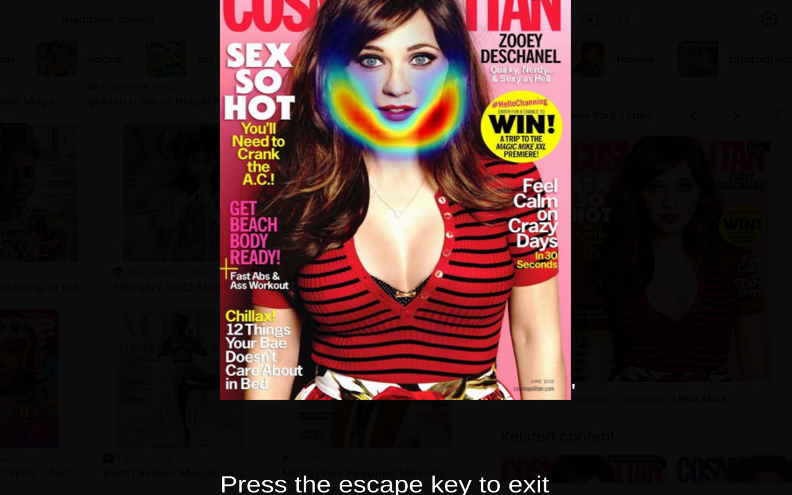

# AuthenticView

AuthenticView is a free AI-driven browser extension which identifies where images have been manipulated to promote an unrealistic body image.

You our browser extension right now [by clicking here!](https://github.com/kevinl95/AuthenticView/releases/tag/v1.0)

AuthenticView lets you right click images on the web and have an AI highlight where it detects the image has been touched up with photoshop, especially with smoothing tools and filters. It is:
- Always free
- Available for Google Chrome

# Examples

