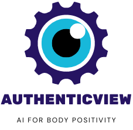

# AuthenticView

AuthenticView is a free AI-driven browser extension which identifies where images have been manipulated to promote an unrealistic body image. Images where the AI tool is more certain manipulation has occured is highlighted in red, whereas areas were it is less sure are highlighted in blue.

Install our browser extension right now [by clicking here!](https://github.com/kevinl95/AuthenticView/releases/tag/v1.0)

You can also play with the model or learn how to integrate the API into your own application [by clicking here!](https://authenticview.beauty/docs)

AuthenticView lets you right click images on the web and have an AI highlight where it detects the image has been touched up with photoshop, especially with smoothing tools and filters. It is:
- Always free
- Available for Google Chrome

## References
The model used in the backend is described in the paper ["Detecting Photoshopped Faces by Scripting Photoshop"](https://arxiv.org/abs/1906.05856) by Wang et al.

# Examples

# Development
Pull requests welcome! This repository has three components:
- The main repository, where you are. This has the FastAPI-built backend service.
- The browser extension, which is in the authenticview-extension submodule at the root of this repository
- The app landing page, which is used for promotion. It is in the authenticview-landing-page submodule

## How to Use
- Clone this repository along with all submodules: `git clone --recurse-submodules https://github.com/kevinl95/AuthenticView.git`
- Install [Python 3](https://www.python.org/downloads/)
- Install Poetry (`pip install poetry`)
- Navigate to the API directory
- Download the AI model weights: `./FALdetector/weights/download_weights.sh`
- Run `poetry install`
- Run `poetry run python app.py`
- In your browser, navigate to http://127.0.0.1:8000/docs. The Swagger UI will now let you play with your new AuthenticView API!
- In the root directory, navigate to the AuthenticView-extension directory for instructions on how to install the extension in Google Chrome. The only dependency for this section is having Chrome installed!
